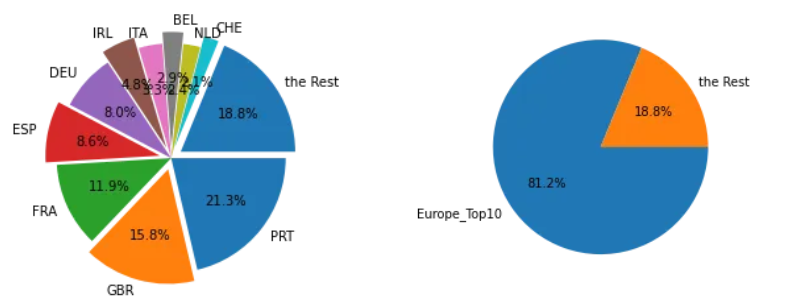
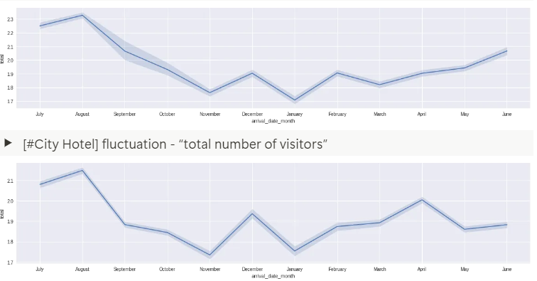
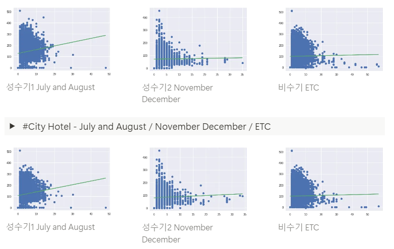

<aside>
👨‍👩‍👧‍👦 **[팀원]**

방미정 정혜나 최윤아 안형준 심규환

</aside>

# EDA

## [00] 데이터 전처리

### 01) 결측치 대체

* `df.isnull().sum()` 을 통한 결측치가 있는 column 확인
  ```python
  hotel                                  0
  is_canceled                            0
  lead_time                              0
  arrival_date_year                      0
  arrival_date_month                     0
  arrival_date_week_number               0
  arrival_date_day_of_month              0
  stays_in_weekend_nights                0
  stays_in_week_nights                   0
  adults                                 0
  children                               4
  babies                                 0
  meal                                   0
  country                              488
  market_segment                         0
  distribution_channel                   0
  is_repeated_guest                      0
  previous_cancellations                 0
  previous_bookings_not_canceled         0
  reserved_room_type                     0
  assigned_room_type                     0
  booking_changes                        0
  deposit_type                           0
  agent                              16340
  company                           112593
  days_in_waiting_list                   0
  customer_type                          0
  adr                                    0
  required_car_parking_spaces            0
  total_of_special_requests              0
  reservation_status                     0
  reservation_status_date                0
  dtype: int64
  ```
* 결측치 대체 : None 값으로 대체
  ```python
  df['children'].fillna('non', inplace=True)
  df['country'].fillna('non', inplace=True)
  df['agent'].fillna('non', inplace=True)
  df['company'].fillna('non', inplace=True)
  ```

<aside>
💡 agent 와 company 의 결측치가 다수 존재 (missing value들의 값이 13%)
→ 결측치를 제거하기엔? 예측 전반에 큰 영향을 줌
→ agent와 company 의 도움없이 호텔을 이용한 것이므로 단순 삭제가 아닌 none 값으로 채움

</aside>

### 02) Top Ten Filtering

<aside>
💡 total revenue를 알아보기 위해 `stay_in_weekend_nights` + `stay_in_week_nights` 조합
→ stay in nights column 정의
평균 일일 숙박 비용 (adr) * stay in nights column
→ total revenue column 정의

상위권 10개의 국가가 모두 유럽권임을 확인했고, 이는 전체 매출의 80%에 육박
모든 나라에 집중하기보다는 유럽을 타겟팅하는 것이 호텔 경영 전략에 도움되리라 판단

</aside>

* `is_canceled`를 제외한 Total Revenue 산정

  ```python
  # is_canceled를 제외한 Total Revenue 산정
  df = df[df["is_canceled"]==0]
  df['stay_in_nights'] = df['stays_in_weekend_nights'] + df1['stays_in_week_nights']
  df["Total_Revenue"] = df["adr"]*df1["stay_in_nights"]
  ```

  ```python
  # Top 10

  df = df.loc[(df['country'] =='PRT') | (df['country'] =='GBR') | 
  						(df['country'] =='FRA') | (df['country'] =='ESP') | 
  						(df['country'] =='DEU') | (df['country'] =='IRL') | 
  						(df['country'] =='ITA') | (df['country'] =='BEL') | 
  						(df['country'] =='NLD') | (df['country'] =='CHE')]
  ```

  ```python
  country
  PRT    5543136.74
  GBR    4112295.34
  FRA    3098696.28
  ESP    2247108.09
  DEU    2068219.65
  IRL    1240002.35
  ITA     866439.42
  BEL     759145.06
  NLD     631663.15
  CHE     548536.40
  USA     490583.56
  BRA     475172.38
  Name: Sales, dtype: float64
  ```

  ```python
  ratio = [5543136,4112295,3098696,2247108,2068219,
           1240002,866439,759145,631663,548536, 4881018]
  labels = ['PRT','GBR',"FRA","ESP","DEU",
            'IRL',"ITA","BEL","NLD","CHE","the Rest"]
  explode = [0, 0.10, 0, 0.10,0,0.10,0,0.1,0,0.1,0.1]
  plt.pie(ratio, labels=labels, autopct='%.1f%%', counterclock=False,explode=explode)
  plt.show()
  ```



<aside>
💡 **PRT** : 포르투갈 Portugal **🇵🇹**
**GBR** : 영국 Great Britain (United Kingdom)**🇬🇧**
**FRA** : 프랑스 France 🇫🇷
**ESP** : 스페인 Español 🇪🇸
**DEU** : 독일 Deutschland (Germany) 🇩🇪
**IRL** : 아일랜드 Ireland 🇮🇪
**ITA** : 이탈리아 Italy 🇮🇹
**BEL** : 벨기에 Belgium 🇧🇪
 **CHE** : 스위스 Switzerland 🇨🇭
**NLD** : 네덜란드 Netherland 🇳🇱

</aside>

```python
city_hotel=top_10.loc[top_10['hotel']=='City Hotel']
resort_hotel=top_10.loc[top_10['hotel']=='Resort Hotel']
```

<aside>
💡 City Hotel - Resort Hotel로 나누어 확인
**City Hotel** : 숙박의 목적이 강한 장소
**Resort Hotel** : 단순 숙박뿐만이 아닌 여가, 휴양의 목적이 강한 장소

</aside>

## [01] 성수기, 비성수기 정의??

<aside>
💡 **취소된 예약을 제외**하고, **합계 매출액이 가장 높게 나오는 국가 top 10**으로 제한

* adults, children, babies 합한 **전체 방문객 수**를 기준으로 **fluctuation**을 살펴보았고,
* **전체 숙박일수**와 **평균 숙박비** 사이의 **regression**을 통해 **할인정책 여부**를 살펴보았음

</aside>

### 01) Resort Hotel vs City Hotel - off-season & peak season

<aside>
💡 Lineplot을 통해 Arrival Month에 따른 trend: Top10 국가 호텔에서의 공통적인 성수기의 특징

**7~8월**에 방문객의 수가 증가하고 (눈에 띄게 매우 많고)
**11~12월**에 방문객의 수가 증가한다 (방문객 수가 많지는 않지만 상승구간을 가짐)

</aside>

* [#Resort Hotel] fluctuation - “total number of visitors”

  ```python
  plt.figure(figsize=(20,4))
  sns.lineplot(data=df[df["hotel"]=='Resort Hotel'],
  						 x='arrival_date_month',y='total',sort=False
  ```
* [#City Hotel] fluctuation - “total number of visitors”

  ```python
  plt.figure(figsize=(20,4))
  sns.lineplot(data=df[df["hotel"]=='City Hotel'],
  						 x='arrival_date_month',y='total',sort=False)
  ```


<aside>
💡 Resort 호텔과 City호텔의 성수기, 비수기에 연박에 대한 할인정책이 있는지 회귀모형으로 살펴보았다.

* 성수기에는 숙박일수가 길어지면 1일 평균 숙박비용이 오히려 **높아짐**
  → 연박 할인정책이 없음 (할인하지 않아도 구매용의가 매우 높음)
* 비수기에는 숙박일수가 길어지면 1일 평균 숙박비용이 **낮아지는** 모습임

   
* #Resort Hotel - July and August / November December / ETC

  ```python
  from sklearn.linear_model import LinearRegression

  X = df.loc[(df['arrival_date_month'] =='July') | (df['arrival_date_month'] =='August')& (df['hotel']=='Resort Hotel')][df['adr']<5000]['stays_in_total_nights']
  y = df.loc[(df['arrival_date_month'] =='July') | (df['arrival_date_month'] =='August')& (df['hotel']=='Resort Hotel')][df['adr']<5000]['adr']

  # 회귀분석 모형 생성
  line_fitter = LinearRegression()
  line_fitter.fit(X.values.reshape(-1,1), y)

  plt.plot(X, y, 'o')
  plt.plot(X, line_fitter.predict(X.values.reshape(-1,1)))
  plt.show()
  ```

  ```python
  from sklearn.linear_model import LinearRegression

  X = df.loc[(df['arrival_date_month'] =='December') | (df['arrival_date_month'] =='January')& (df['hotel']=='Resort Hotel')][df['adr']<5000]['stays_in_total_nights']
  y = df.loc[(df['arrival_date_month'] =='December') | (df['arrival_date_month'] =='January')& (df['hotel']=='Resort Hotel')][df['adr']<5000]['adr']

  # 회귀분석 모형 생성
  line_fitter = LinearRegression()
  line_fitter.fit(X.values.reshape(-1,1), y)

  plt.plot(X, y, 'o')
  plt.plot(X, line_fitter.predict(X.values.reshape(-1,1)))
  plt.show()
  ```

  ```python
  from sklearn.linear_model import LinearRegression

  X = df.loc[(df['arrival_date_month'] =='March') | (df['arrival_date_month'] =='April') | (df['arrival_date_month'] =='May') | (df['arrival_date_month'] =='June') | (df['arrival_date_month'] =='July') | (df['arrival_date_month'] =='September') | (df['arrival_date_month'] =='October') | (df['arrival_date_month'] =='November') & (df['hotel']=='Resort Hotel')][df['adr']<5000]['stays_in_total_nights']
  y = df.loc[(df['arrival_date_month'] =='March') | (df['arrival_date_month'] =='April') | (df['arrival_date_month'] =='May') | (df['arrival_date_month'] =='June') | (df['arrival_date_month'] =='July') | (df['arrival_date_month'] =='September') | (df['arrival_date_month'] =='October') | (df['arrival_date_month'] =='November') & (df['hotel']=='Resort Hotel')][df['adr']<5000]['adr']
  # 회귀분석 모형 생성
  line_fitter = LinearRegression()
  line_fitter.fit(X.values.reshape(-1,1), y)

  plt.plot(X, y, 'o')
  plt.plot(X, line_fitter.predict(X.values.reshape(-1,1)))
  plt.show()
  ```


성수기1 July and August


성수기2 November December


비수기 ETC

* #City Hotel - July and August / November December / ETC

  ```python
  from sklearn.linear_model import LinearRegression

  X = df.loc[(df['arrival_date_month'] =='July') | (df['arrival_date_month'] =='August')& (df['hotel']=='City Hotel')][df['adr']<5000]['stays_in_total_nights']
  y = df.loc[(df['arrival_date_month'] =='July') | (df['arrival_date_month'] =='August')& (df['hotel']=='City Hotel')][df['adr']<5000]['adr']
  # 회귀분석 모형 생성
  line_fitter = LinearRegression()
  line_fitter.fit(X.values.reshape(-1,1), y)

  plt.plot(X, y, 'o')
  plt.plot(X, line_fitter.predict(X.values.reshape(-1,1)))
  plt.show()
  ```

  ```python
  from sklearn.linear_model import LinearRegression

  X = df.loc[(df['arrival_date_month'] =='December') | (df['arrival_date_month'] =='January')& (df['hotel']=='City Hotel')][df['adr']<5000]['stays_in_total_nights']
  y = df.loc[(df['arrival_date_month'] =='December') | (df['arrival_date_month'] =='January')& (df['hotel']=='City Hotel')][df['adr']<5000]['adr']
  # 회귀분석 모형 생성
  line_fitter = LinearRegression()
  line_fitter.fit(X.values.reshape(-1,1), y)

  plt.plot(X, y, 'o')
  plt.plot(X, line_fitter.predict(X.values.reshape(-1,1)))
  plt.show()
  ```

  ```python
  from sklearn.linear_model import LinearRegression

  X = df.loc[(df['arrival_date_month'] =='March') | (df['arrival_date_month'] =='April') | (df['arrival_date_month'] =='May') | (df['arrival_date_month'] =='June') | (df['arrival_date_month'] =='July') | (df['arrival_date_month'] =='September') | (df['arrival_date_month'] =='October') | (df['arrival_date_month'] =='November')& (df['hotel']=='City Hotel')][df['adr']<5000]['stays_in_total_nights']
  y = df.loc[(df['arrival_date_month'] =='March') | (df['arrival_date_month'] =='April') | (df['arrival_date_month'] =='May') | (df['arrival_date_month'] =='June') | (df['arrival_date_month'] =='July') | (df['arrival_date_month'] =='September') | (df['arrival_date_month'] =='October') | (df['arrival_date_month'] =='November')& (df['hotel']=='City Hotel')][df['adr']<5000]['adr']

  # 회귀분석 모형 생성
  line_fitter = LinearRegression()
  line_fitter.fit(X.values.reshape(-1,1), y)

  plt.plot(X, y, 'o')
  plt.plot(X, line_fitter.predict(X.values.reshape(-1,1)))
  plt.show()
  ```


성수기1 July and August


성수기2 November December


비수기 ETC

## [02] 과연 어떤 방이 좋은 방인가?

<aside>
💡 **크로스탭**을 사용하여, 예약한 방의 **타입 별 방문객 수 규모**를 파악할 수 있었는데,

* room type의 경우 **City-F~G타입** / **Resort-G~H타입이 여러명 수용** 가능한 방
* 보유 room의 수는 **City-A,D타입** / **Resort-A,D타입이 가장 많은 일반적인 방이었음**

</aside>

### 00) Hotel room - Large vs Small

* #City Hotel vs Resort Hotel : room type & size
  ```python
  pd.crosstab([df.hotel, df.reserved_room_type], [df.total_scale],
              margins=True).style.background_gradient(cmap='summer_r')

  ## room type의 경우 City-F~G타입 / Resort-G~H타입이 여러명 수용 가능한 방인 것 같음
  ## 보유 room의 수는 City-A,D타입 / Resort-A,D타입이 가장 많은 일반적인 방인 것 같기도
  ```

| total_scale   | **02 이하** | **02초과 04이하** | **04초과 06미만** | **08초과 10미만** | **10초과** | **All** |
| ------------- | ----------------- | ----------------------- | ----------------------- | ----------------------- | ---------------- | ------------- |
| City Hotel    |                   |                         |                         |                         |                  |               |
| **A**   | 49338             | 2333                    | 0                       | 1                       | 0                | 51672         |
| **B**   | 742               | 80                      | 4                       | 0                       | 0                | 826           |
| **C**   | 12                | 1                       | 0                       | 0                       | 0                | 13            |
| **D**   | 5904              | 2649                    | 1                       | 0                       | 1                | 8555          |
| **E**   | 647               | 468                     | 1                       | 0                       | 0                | 1116          |
| **F**   | 154               | 1088                    | 10                      | 0                       | 0                | 1252          |
| **G**   | 102               | 184                     | 52                      | 0                       | 0                | 338           |
| **P**   | 2                 | 0                       | 0                       | 0                       | 0                | 2             |
| Resort Hotel  |                   |                         |                         |                         |                  |               |
| **A**   | 19743             | 1151                    | 3                       | 0                       | 10               | 20907         |
| **B**   | 3                 | 0                       | 0                       | 0                       | 0                | 3             |
| **C**   | 157               | 607                     | 3                       | 0                       | 0                | 767           |
| **D**   | 5928              | 510                     | 0                       | 0                       | 3                | 6441          |
| **E**   | 3795              | 286                     | 1                       | 1                       | 0                | 4083          |
| **F**   | 784               | 119                     | 0                       | 0                       | 0                | 903           |
| **G**   | 268               | 939                     | 11                      | 0                       | 0                | 1218          |
| **H**   | 42                | 411                     | 21                      | 0                       | 0                | 474           |
| **L**   | 5                 | 1                       | 0                       | 0                       | 0                | 6             |
| **All** | 87626             | 10827                   | 107                     | 2                       | 14               | 98576         |

<aside>
💡 **  **R** : 비싼방,  **B** : 저렴한방,  **G** : 중간 구간에 집중된 방,  **Y** : 다양한 구간에서 고르게 판매되는 방

* Resort Hotel
* 비수기 : **A, D 푸른색 → 저렴한 방 / C, G 붉은 색 → 비싼 방**
* 성수기 : Room Type B를 제외한 모든 방들이 **붉은 색으로 칠해짐**
  모든 Type의 방, 특히 비수기에 저렴했던 방들 또한 더 비싸짐을 확인
  → 방의 가격이 높아짐에도, 사람들의 구매 용의가 높은 성수기임을 재확인
* City Hotel : 비슷한 경향성으로 나타남을 확인

</aside>

### 01) Resort Hotel room type - Expensive vs Cheap

* #Resort Hotel : 비수기 ETC

  ```python
  f, ax = plt.subplots(2, 4, figsize=(25, 10))

  # dist plot

  sns.distplot(df[(df['hotel'] == 'Resort Hotel') & (df['reserved_room_type'] == 'A') & (df['month_scale'] =='비수기')].adr_scale, ax=ax[0,0], color='b')
  ax[0,0].set_title('A')

  sns.distplot(df[(df['hotel'] == 'Resort Hotel') & (df['reserved_room_type'] == 'B') & (df['month_scale'] =='비수기')].adr_scale, ax=ax[0,1], color='g')
  ax[0,1].set_title('B')

  sns.distplot(df[(df['hotel'] == 'Resort Hotel') & (df['reserved_room_type'] == 'C') & (df['month_scale'] =='비수기')].adr_scale, ax=ax[0,2], color='r')
  ax[0,2].set_title('C')

  sns.distplot(df[(df['hotel'] == 'Resort Hotel') & (df['reserved_room_type'] == 'D') & (df['month_scale'] =='비수기')].adr_scale, ax=ax[0,3], color='b')
  ax[0,3].set_title('D')

  sns.distplot(df[(df['hotel'] == 'Resort Hotel') & (df['reserved_room_type'] == 'E') & (df['month_scale'] =='비수기')].adr_scale, ax=ax[1,0], color='y')
  ax[1,0].set_title('E')

  sns.distplot(df[(df['hotel'] == 'Resort Hotel') & (df['reserved_room_type'] == 'F') & (df['month_scale'] =='비수기')].adr_scale, ax=ax[1,1], color='y')
  ax[1,1].set_title('F')

  sns.distplot(df[(df['hotel'] == 'Resort Hotel') & (df['reserved_room_type'] == 'G') & (df['month_scale'] =='비수기')].adr_scale, ax=ax[1,2], color='r')
  ax[1,2].set_title('G')

  sns.distplot(df[(df['hotel'] == 'Resort Hotel') & (df['reserved_room_type'] == 'L') & (df['month_scale'] =='비수기')].adr_scale, ax=ax[1,3], color='b')
  ax[1,3].set_title('L')

  plt.show()
  ```

  ```python
  f, ax = plt.subplots(2, 4, figsize=(25, 10))

  # dist plot

  sns.distplot(df[(df['hotel'] == 'Resort Hotel') & (df['reserved_room_type'] == 'A') & (df['month_scale'] =='성수기(7,8)')].adr_scale, ax=ax[0,0], color='r')
  ax[0,0].set_title('A')

  sns.distplot(df[(df['hotel'] == 'Resort Hotel') & (df['reserved_room_type'] == 'B') & (df['month_scale'] =='성수기(7,8)')].adr_scale, ax=ax[0,1], color='g')
  ax[0,1].set_title('B')

  sns.distplot(df[(df['hotel'] == 'Resort Hotel') & (df['reserved_room_type'] == 'C') & (df['month_scale'] =='성수기(7,8)')].adr_scale, ax=ax[0,2], color='r')
  ax[0,2].set_title('C')

  sns.distplot(df[(df['hotel'] == 'Resort Hotel') & (df['reserved_room_type'] == 'D') & (df['month_scale'] =='성수기(7,8)')].adr_scale, ax=ax[0,3], color='r')
  ax[0,3].set_title('D')

  sns.distplot(df[(df['hotel'] == 'Resort Hotel') & (df['reserved_room_type'] == 'E') & (df['month_scale'] =='성수기(7,8)')].adr_scale, ax=ax[1,0], color='r')
  ax[1,0].set_title('E')

  sns.distplot(df[(df['hotel'] == 'Resort Hotel') & (df['reserved_room_type'] == 'F') & (df['month_scale'] =='성수기(7,8)')].adr_scale, ax=ax[1,1], color='r')
  ax[1,1].set_title('F')

  sns.distplot(df[(df['hotel'] == 'Resort Hotel') & (df['reserved_room_type'] == 'G') & (df['month_scale'] =='성수기(7,8)')].adr_scale, ax=ax[1,2], color='r')
  ax[1,2].set_title('G')

  sns.distplot(df[(df['hotel'] == 'Resort Hotel') & (df['reserved_room_type'] == 'L') & (df['month_scale'] =='성수기(7,8)')].adr_scale, ax=ax[1,3], color='r')
  ax[1,3].set_title('L')

  plt.show()
  ```

  ```python
  f, ax = plt.subplots(2, 4, figsize=(25, 10))

  # dist plot

  sns.distplot(df[(df['hotel'] == 'Resort Hotel') & (df['reserved_room_type'] == 'A') & (df['month_scale'] =='성수기(12,1)')].adr_scale, ax=ax[0,0], color='b')
  ax[0,0].set_title('A')

  sns.distplot(df[(df['hotel'] == 'Resort Hotel') & (df['reserved_room_type'] == 'B') & (df['month_scale'] =='성수기(12,1)')].adr_scale, ax=ax[0,1], color='w')
  ax[0,1].set_title('B')

  sns.distplot(df[(df['hotel'] == 'Resort Hotel') & (df['reserved_room_type'] == 'C') & (df['month_scale'] =='성수기(12,1)')].adr_scale, ax=ax[0,2], color='b')
  ax[0,2].set_title('C')

  sns.distplot(df[(df['hotel'] == 'Resort Hotel') & (df['reserved_room_type'] == 'D') & (df['month_scale'] =='성수기(12,1)')].adr_scale, ax=ax[0,3], color='b')
  ax[0,3].set_title('D')

  sns.distplot(df[(df['hotel'] == 'Resort Hotel') & (df['reserved_room_type'] == 'E') & (df['month_scale'] =='성수기(12,1)')].adr_scale, ax=ax[1,0], color='b')
  ax[1,0].set_title('E')

  sns.distplot(df[(df['hotel'] == 'Resort Hotel') & (df['reserved_room_type'] == 'F') & (df['month_scale'] =='성수기(12,1)')].adr_scale, ax=ax[1,1], color='b')
  ax[1,1].set_title('F')

  sns.distplot(df[(df['hotel'] == 'Resort Hotel') & (df['reserved_room_type'] == 'G') & (df['month_scale'] =='성수기(12,1)')].adr_scale, ax=ax[1,2], color='b')
  ax[1,2].set_title('G')

  sns.distplot(df[(df['hotel'] == 'Resort Hotel') & (df['reserved_room_type'] == 'L') & (df['month_scale'] =='성수기(12,1)')].adr_scale, ax=ax[1,3], color='w')
  ax[1,3].set_title('L')

  plt.show()
  ```

<aside>
💡 **  **R** : 비싼방,  **B** : 저렴한방,  **G** : 중간 구간에 집중된 방,  **Y** : 다양한 구간에서 고르게 판매되는 방

* 리조트호텔 방문객이 많지 않은 비수기에는 가격 분포가 매우 다양하게 나타나고 있음.
* A와 D룸은 가장 **저렴한 방** (가장 많은 방이기도 함)
* E와 F룸은 다양한 구간에서 고르게 , B룸의 경우 중간 구간에서만 나타남
* C와 G룸은 가장 **비싼 방**

</aside>


Resort Hotel - 비수기

* #Resort Hotel : 성수기1 July and August (7월, 8월)
  ```python
  f, ax = plt.subplots(2, 4, figsize=(25, 10))

  # dist plot

  sns.distplot(df[(df['hotel'] == 'Resort Hotel') & (df['reserved_room_type'] == 'A') & (df['month_scale'] =='성수기(7,8)')].adr_scale, ax=ax[0,0], color='r')
  ax[0,0].set_title('A')

  sns.distplot(df[(df['hotel'] == 'Resort Hotel') & (df['reserved_room_type'] == 'B') & (df['month_scale'] =='성수기(7,8)')].adr_scale, ax=ax[0,1], color='g')
  ax[0,1].set_title('B')

  sns.distplot(df[(df['hotel'] == 'Resort Hotel') & (df['reserved_room_type'] == 'C') & (df['month_scale'] =='성수기(7,8)')].adr_scale, ax=ax[0,2], color='r')
  ax[0,2].set_title('C')

  sns.distplot(df[(df['hotel'] == 'Resort Hotel') & (df['reserved_room_type'] == 'D') & (df['month_scale'] =='성수기(7,8)')].adr_scale, ax=ax[0,3], color='r')
  ax[0,3].set_title('D')

  sns.distplot(df[(df['hotel'] == 'Resort Hotel') & (df['reserved_room_type'] == 'E') & (df['month_scale'] =='성수기(7,8)')].adr_scale, ax=ax[1,0], color='r')
  ax[1,0].set_title('E')

  sns.distplot(df[(df['hotel'] == 'Resort Hotel') & (df['reserved_room_type'] == 'F') & (df['month_scale'] =='성수기(7,8)')].adr_scale, ax=ax[1,1], color='r')
  ax[1,1].set_title('F')

  sns.distplot(df[(df['hotel'] == 'Resort Hotel') & (df['reserved_room_type'] == 'G') & (df['month_scale'] =='성수기(7,8)')].adr_scale, ax=ax[1,2], color='r')
  ax[1,2].set_title('G')

  sns.distplot(df[(df['hotel'] == 'Resort Hotel') & (df['reserved_room_type'] == 'L') & (df['month_scale'] =='성수기(7,8)')].adr_scale, ax=ax[1,3], color='r')
  ax[1,3].set_title('L')

  plt.show()
  ```

<aside>
💡 **  **R** : 비싼방,  **B** : 저렴한방,  **G** : 중간 구간에 집중된 방,  **Y** : 다양한 구간에서 고르게 판매되는 방

* 성수기에는 원래 저렴했던 A, D룸도 **비싸지며**
* 1~2구간에 집중되었던 B룸도 **3구간으로 이동함(비싸짐)**
* 다양한 구간에서 고르게 나타나던 E와 F룸도  **비싸졌고** ,
* 원래 비쌌던 C, G룸도 더 **비싸지는** 것을 확인할 수 있었음

</aside>


Resort Hotel - 성수기 1 (7월, 8월)

* #Resort Hotel :  성수기2 November December (11월, 12월)
  ```python
  f, ax = plt.subplots(2, 4, figsize=(25, 10))

  # dist plot

  sns.distplot(df[(df['hotel'] == 'Resort Hotel') & (df['reserved_room_type'] == 'A') & (df['month_scale'] =='성수기(12,1)')].adr_scale, ax=ax[0,0], color='b')
  ax[0,0].set_title('A')

  sns.distplot(df[(df['hotel'] == 'Resort Hotel') & (df['reserved_room_type'] == 'B') & (df['month_scale'] =='성수기(12,1)')].adr_scale, ax=ax[0,1], color='w')
  ax[0,1].set_title('B')

  sns.distplot(df[(df['hotel'] == 'Resort Hotel') & (df['reserved_room_type'] == 'C') & (df['month_scale'] =='성수기(12,1)')].adr_scale, ax=ax[0,2], color='b')
  ax[0,2].set_title('C')

  sns.distplot(df[(df['hotel'] == 'Resort Hotel') & (df['reserved_room_type'] == 'D') & (df['month_scale'] =='성수기(12,1)')].adr_scale, ax=ax[0,3], color='b')
  ax[0,3].set_title('D')

  sns.distplot(df[(df['hotel'] == 'Resort Hotel') & (df['reserved_room_type'] == 'E') & (df['month_scale'] =='성수기(12,1)')].adr_scale, ax=ax[1,0], color='b')
  ax[1,0].set_title('E')

  sns.distplot(df[(df['hotel'] == 'Resort Hotel') & (df['reserved_room_type'] == 'F') & (df['month_scale'] =='성수기(12,1)')].adr_scale, ax=ax[1,1], color='b')
  ax[1,1].set_title('F')

  sns.distplot(df[(df['hotel'] == 'Resort Hotel') & (df['reserved_room_type'] == 'G') & (df['month_scale'] =='성수기(12,1)')].adr_scale, ax=ax[1,2], color='b')
  ax[1,2].set_title('G')

  sns.distplot(df[(df['hotel'] == 'Resort Hotel') & (df['reserved_room_type'] == 'L') & (df['month_scale'] =='성수기(12,1)')].adr_scale, ax=ax[1,3], color='w')
  ax[1,3].set_title('L')

  plt.show()
  ```

<aside>
💡 **  **R** : 비싼방,  **B** : 저렴한방,  **G** : 중간 구간에 집중된 방,  **Y** : 다양한 구간에서 고르게 판매되는 방

* 11, 12월에는 상당히  **저렴하다** . (블랙프라이데이 등 연말/연초 할인 때문)

</aside>


Resort Hotel - 성수기 2 (12월, 1월)

### 02) City Hotel room type - Expensive vs Cheap

* #City Hotel : 비수기 ETC
  ```python
  f, ax = plt.subplots(2, 4, figsize=(25, 10))

  # dist plot

  sns.distplot(df[(df['hotel'] == 'City Hotel') & (df['reserved_room_type'] == 'A') & (df['month_scale'] =='비수기')].adr_scale, ax=ax[0,0], color='y')
  ax[0,0].set_title('A')

  sns.distplot(df[(df['hotel'] == 'City Hotel') & (df['reserved_room_type'] == 'B') & (df['month_scale'] =='비수기')].adr_scale, ax=ax[0,1], color='y')
  ax[0,1].set_title('B')

  sns.distplot(df[(df['hotel'] == 'City Hotel') & (df['reserved_room_type'] == 'C') & (df['month_scale'] =='비수기')].adr_scale, ax=ax[0,2], color='g')
  ax[0,2].set_title('C')

  sns.distplot(df[(df['hotel'] == 'City Hotel') & (df['reserved_room_type'] == 'D') & (df['month_scale'] =='비수기')].adr_scale, ax=ax[0,3], color='r')
  ax[0,3].set_title('D')

  sns.distplot(df[(df['hotel'] == 'City Hotel') & (df['reserved_room_type'] == 'E') & (df['month_scale'] =='비수기')].adr_scale, ax=ax[1,0], color='r')
  ax[1,0].set_title('E')

  sns.distplot(df[(df['hotel'] == 'City Hotel') & (df['reserved_room_type'] == 'F') & (df['month_scale'] =='비수기')].adr_scale, ax=ax[1,1], color='r')
  ax[1,1].set_title('F')

  sns.distplot(df[(df['hotel'] == 'City Hotel') & (df['reserved_room_type'] == 'G') & (df['month_scale'] =='비수기')].adr_scale, ax=ax[1,2], color='r')
  ax[1,2].set_title('G')

  sns.distplot(df[(df['hotel'] == 'City Hotel') & (df['reserved_room_type'] == 'L') & (df['month_scale'] =='비수기')].adr_scale, ax=ax[1,3], color='w')
  ax[1,3].set_title('P')

  plt.show()
  ```

<aside>
💡 **  **R** : 비싼방,  **B** : 저렴한방,  **G** : 중간 구간에 집중된 방,  **Y** : 다양한 구간에서 고르게 판매되는 방

* 시티호텔 방문객이 많지 않은 비수기에는 가격 분포가 매우 다양하게 나타나고 있음.
* A와 B룸은 다양한 구간에서 고르게 , C룸의 경우 중간 구간에서만 나타남
* D, E, F와 G룸은 비수기에도 **비싼 방**

</aside>


* #City Hotel : 성수기1 July and August (7월, 8월)
  ```python
  f, ax = plt.subplots(2, 4, figsize=(25, 10))

  # dist plot

  sns.distplot(df[(df['hotel'] == 'City Hotel') & (df['reserved_room_type'] == 'A') & (df['month_scale'] =='성수기(7,8)')].adr_scale, ax=ax[0,0], color='y')
  ax[0,0].set_title('A')

  sns.distplot(df[(df['hotel'] == 'City Hotel') & (df['reserved_room_type'] == 'B') & (df['month_scale'] =='성수기(7,8)')].adr_scale, ax=ax[0,1], color='y')
  ax[0,1].set_title('B')

  sns.distplot(df[(df['hotel'] == 'City Hotel') & (df['reserved_room_type'] == 'C') & (df['month_scale'] =='성수기(7,8)')].adr_scale, ax=ax[0,2], color='g')
  ax[0,2].set_title('C')

  sns.distplot(df[(df['hotel'] == 'City Hotel') & (df['reserved_room_type'] == 'D') & (df['month_scale'] =='성수기(7,8)')].adr_scale, ax=ax[0,3], color='r')
  ax[0,3].set_title('D')

  sns.distplot(df[(df['hotel'] == 'City Hotel') & (df['reserved_room_type'] == 'E') & (df['month_scale'] =='성수기(7,8)')].adr_scale, ax=ax[1,0], color='r')
  ax[1,0].set_title('E')

  sns.distplot(df[(df['hotel'] == 'City Hotel') & (df['reserved_room_type'] == 'F') & (df['month_scale'] =='성수기(7,8)')].adr_scale, ax=ax[1,1], color='r')
  ax[1,1].set_title('F')

  sns.distplot(df[(df['hotel'] == 'City Hotel') & (df['reserved_room_type'] == 'G') & (df['month_scale'] =='성수기(7,8)')].adr_scale, ax=ax[1,2], color='r')
  ax[1,2].set_title('G')

  sns.distplot(df[(df['hotel'] == 'City Hotel') & (df['reserved_room_type'] == 'L') & (df['month_scale'] =='성수기(7,8)')].adr_scale, ax=ax[1,3], color='w')
  ax[1,3].set_title('P')

  plt.show()
  ```

<aside>
💡 **  **R** : 비싼방,  **B** : 저렴한방,  **G** : 중간 구간에 집중된 방,  **Y** : 다양한 구간에서 고르게 판매되는 방

* A, B, C 룸은 큰 차이 없지만
* D, E, F, G 룸의 가격대는  **높아짐** (분산이 작아짐)

</aside>


* #City Hotel :  성수기2 November December (11월, 12월)
  ```python
  f, ax = plt.subplots(2, 4, figsize=(25, 10))

  # dist plot

  sns.distplot(df[(df['hotel'] == 'City Hotel') & (df['reserved_room_type'] == 'A') & (df['month_scale'] =='성수기(7,8)')].adr_scale, ax=ax[0,0], color='y')
  ax[0,0].set_title('A')

  sns.distplot(df[(df['hotel'] == 'City Hotel') & (df['reserved_room_type'] == 'B') & (df['month_scale'] =='성수기(7,8)')].adr_scale, ax=ax[0,1], color='y')
  ax[0,1].set_title('B')

  sns.distplot(df[(df['hotel'] == 'City Hotel') & (df['reserved_room_type'] == 'C') & (df['month_scale'] =='성수기(7,8)')].adr_scale, ax=ax[0,2], color='g')
  ax[0,2].set_title('C')

  sns.distplot(df[(df['hotel'] == 'City Hotel') & (df['reserved_room_type'] == 'D') & (df['month_scale'] =='성수기(7,8)')].adr_scale, ax=ax[0,3], color='r')
  ax[0,3].set_title('D')

  sns.distplot(df[(df['hotel'] == 'City Hotel') & (df['reserved_room_type'] == 'E') & (df['month_scale'] =='성수기(7,8)')].adr_scale, ax=ax[1,0], color='r')
  ax[1,0].set_title('E')

  sns.distplot(df[(df['hotel'] == 'City Hotel') & (df['reserved_room_type'] == 'F') & (df['month_scale'] =='성수기(7,8)')].adr_scale, ax=ax[1,1], color='r')
  ax[1,1].set_title('F')

  sns.distplot(df[(df['hotel'] == 'City Hotel') & (df['reserved_room_type'] == 'G') & (df['month_scale'] =='성수기(7,8)')].adr_scale, ax=ax[1,2], color='r')
  ax[1,2].set_title('G')

  sns.distplot(df[(df['hotel'] == 'City Hotel') & (df['reserved_room_type'] == 'L') & (df['month_scale'] =='성수기(7,8)')].adr_scale, ax=ax[1,3], color='w')
  ax[1,3].set_title('P')

  plt.show()
  ```

<aside>
💡 **  **R** : 비싼방,  **B** : 저렴한방,  **G** : 중간 구간에 집중된 방,  **Y** : 다양한 구간에서 고르게 판매되는 방

* Resort와는 다르게 비싼 방은  **여전히 비쌈** .
* 하지만 비싼 방들의 구매가격 구간이 보다 다양해진 것으로 보임 (분산이 커짐)

</aside>


## [03] `kids` col

<aside>
💡 baby 나 children 칼럼의 값이 0보다 큰 경우 → kids 칼럼의 값은 1로

adult만 방문했을 경우 → kids 칼럼의 값은 0으로 설정

* 리조트 호텔이 아이가 없는 성인 손님의 비율보다 아이가 동반된 가족단위 손님의 비율이 높다.
* total of special requests의 수가 늘어날 수록 kids가 있는 경우의 비율이 늘어난다.
  → kids 가 있을 수록 요구사항의 수가 많아진다는 뜻
  </aside>

<aside>
💡 kids가 0일 때 보다 1일 때 더 많은 parking space를 필요로 함

* City hotel과 Resort hotel 모두 가족단위의 손님들은 parking space에 대한 수요가 있다
  </aside>

### 01) kids의 유무와 특별 요청

* 리조트 호텔이 아이가 없는 성인 손님의 비율보다 아이가 동반된 가족단위 손님의 비율이 높다.
* kids 의 유무와 Special Request
  ```python
  top_10['kids'] = 0
  top_10.loc[(df['children']>0)|(top_10['babies']>0),'kids'] = 1
  top_10.head()
  pd.crosstab(top_10['hotel'],top_10['kids']).apply(lambda r: r/r.sum(),axis=0)
  pd.crosstab(top_10['total_of_special_requests'],top_10['kids']).apply(lambda r: r/r.sum(),axis=1)

  ```


방문객 kids의 비중


kids 의 유무와 특별 요청

* kids 의 유무와 Parking Space
  ```python
  sns.factorplot('kids', 'required_car_parking_spaces', data=top_10) 
  fig = plt.gcf() 
  fig.set_size_inches(10, 5) 
  plt.show()
  ```


City hotel의 kids - parking space


Resort hotel의 kids - parking space

* adult vs children vs babies

  ```python
  plt.figure(figsize=(20,4))
  sns.lineplot(data=df[df["hotel"]=='Resort Hotel'],x='arrival_date_month',y='adults',sort=Fal
  ```

  ```python
  plt.figure(figsize=(20,4))
  sns.lineplot(data=df[df["hotel"]=='City Hotel'],x='arrival_date_month',y='adults')
  ```

  ```python
  plt.figure(figsize=(20,4))
  sns.lineplot(data=df[df["hotel"]=='Resort Hotel'],x='arrival_date_month',y='children')
  ```

  ```python
  plt.figure(figsize=(20,4))
  sns.lineplot(data=df[df["hotel"]=='City Hotel'],x='arrival_date_month',y='children')
  ```

  ```python
  plt.figure(figsize=(20,4))
  sns.lineplot(data=df[df["hotel"]=='Resort Hotel'],x='arrival_date_month',y='babies')
  ```

  ```python
  plt.figure(figsize=(20,4))
  sns.lineplot(data=df[df["hotel"]=='City Hotel'],x='arrival_date_month',y='babies')
  ```

<aside>
💡 `arrival_date_month` 를 살펴보면,

* babies는 성수기 7~8월에서 City호텔에 잘 방문하지 않는다.
* → 아마 new born baby를 가진 젊은 부부들에게
  **성수기 7~8월에 City호텔의 adr이 너무 높기 때문일 것 (비싸다는 뜻)**
  </aside>


Resort - adults


Resort - children


Resort - babies


City - adults


City - children


City - babies

## [04] 고객 유치 방안

### 01) 신규 고객 유치 방안

* 신규 고객 : `is_repeated_guests`=0 인 고객으로 규정
  ```python
  f, ax = plt.subplots(1,1, figsize=(18, 8))
  top_10['is_repeated_guest'].value_counts().plot.pie(autopct='%1.1f%%',
  																										shadow=True,
  																										fontsize=17)
  plt.show()
  ```

<aside>
💡 신규 고객 비율이 약 96.4%에 육박 → **신규 고객이 많은 호텔**임을 확인

</aside>


### 02) 신규 고객 유입경로 분석

* [CrossTab] 신규 고객 & `market_segment`
  ```python
  pd.crosstab(top_10['market_segment'],
  						top_10['is_repeated_guest']).apply(lambda r: r/r.sum(),axis=0)
  ```

<aside>
💡 **Online TA**가 비율이 48%로 절반 가량을 차지함을 알 수 있음

* 온라인을 통한 유입 경로가 다른 경로들보다 활성화되어 있다!
* 반면에 Direct의 비중은 낮음

</aside>


## [05] `adr` 요소 분석

### 01) adr과 취소율 비교

<aside>
💡 **사분위수**로 adr band를 정의하여 hotel type에 따른 cancel 여부를 분석하였다.

* city_hotel의 경우에는 명확한 패턴을 찾지 못했다.
* resort hotel의 경우 adr이 높을수록 **취소율이 높았다.**

</aside>

* Hotel의 Type에 따른 **Quantile(4분위수)** 정의
  ```python
  print(np.quantile(resort_hotel['adr'], [0.25, 0.5, 0.75]))
  print(np.quantile(city_hotel['adr'], [0.25, 0.5, 0.75]))
  ```
* [Factorplot]
  `resort_hotel` - `adr` & `is_canceled`
  ```python
  resort_hotel['adr_band'] = 0
  resort_hotel.loc[resort_hotel['adr'] <= 50, 'adr_band'] = 0
  resort_hotel.loc[(resort_hotel['adr'] > 50) & (resort_hotel['adr'] <= 75), 'adr_band'] = 1
  resort_hotel.loc[(resort_hotel['adr'] > 75) & (resort_hotel['adr'] <= 125), 'adr_band'] = 2
  resort_hotel.loc[resort_hotel['adr'] > 125, 'adr_band'] = 3
  sns.factorplot('adr_band', 'is_canceled', data=resort_hotel)
  plt.show()
  ```
* [Factorplot]
  `city_hotel` - `adr` & `is_canceled`
  ```python
  city_hotel['adr_band'] = 0
  city_hotel.loc[city_hotel['adr'] <= 79.2, 'adr_band'] = 0
  city_hotel.loc[(city_hotel['adr'] > 79.2) & (city_hotel['adr'] <= 99.9), 'adr_band'] = 1
  city_hotel.loc[(city_hotel['adr'] > 99.9) & (city_hotel['adr'] <= 126), 'adr_band'] = 2
  city_hotel.loc[city_hotel['adr'] > 126, 'adr_band'] = 3
  sns.factorplot('adr_band', 'is_canceled', data=city_hotel)
  plt.show()
  ```


### 02) adr 과 hotel & deposit_type

<aside>
💡 resort_hotel과 보증금(deposit)에 관련된 분석 진행
resort hotel의 경우 adr이 높은 방에 대해서는 deposit을 적용하지 않고 있다.
→ No Deposit이 높은 취소율과 관련이 있을 수도 있다고 판단

</aside>

* [Catplot] `hotel` - `deposit type` & `hotel`
  ```python
  plot = sns.catplot(x="adr_band", y="deposit_type", row="hotel",
  									kind="box", orient="h", height=1.5, aspect=4,data=data)
  ```


### 03) 이벤트 수혜자 색인

<aside>
💡 adr 살펴보는 와중 특이점 발견 : adr이 음수인 경우
→ 하나의 데이터밖에 없었기에 anomaly(이상치)로 생각

`stay in nights>0`임에도 `adr=0`
→ market_segment 확인, complementary가 높은 비율을 차지
→ complementary의 정의에 의해 이벤트 수혜자 정의 :
`total_revenue=0` & `stay_in_nights`>0인 사람

</aside>

* 연도별 이벤트 수혜자 수
  ```python
  #돈안내고, 숙박은 한 사람을 이벤트 혜택/마케팅 혜택 수혜자라고 생각해본다면...
  event_2015 = df[(df["Sales"]==0)&(df["stay_in_nights"]>0)&(df["arrival_date_year"]==2015)]
  event_2016 = df[(df["Sales"]==0)&(df["stay_in_nights"]>0)&(df["arrival_date_year"]==2016)]
  event_2017 = df[(df["Sales"]==0)&(df["stay_in_nights"]>0)&(df["arrival_date_year"]==2017)]

  print(f'2015년: {len(event_2015)}')
  print(f'2016년: {len(event_2016)}')
  print(f'2017년: {len(event_2017)}')
  ```


* City Hotel 연도별 이벤트 수혜자 수
  ```python
  #이벤트 혜택 수혜자가 대부분 city hotel에서 머무름.
  event_2015_city = event_2015[event_2015["hotel"]=="City Hotel"]
  event_2016_city = event_2016[event_2016["hotel"]=="City Hotel"]
  event_2017_city = event_2017[event_2017["hotel"]=="City Hotel"]

  print(f'2015년: {len(event_2015_city)}')
  print(f'2016년: {len(event_2016_city)}')
  print(f'2017년: {len(event_2017_city)}')
  ```


<aside>
💡 **Complementary의 정의 [[출처]](https://www.definitions.net/definition/COMPLIMENTARY%20ACCOMMODATION)**

호텔에 묵을 수 있는 권한이 있고 호텔 서비스의 일부 또는 전부를 사용하게 되지만, 비용을 지불하지 않아도 되는 경우  ex) 상품으로 호텔 숙박권을 받았을 때

</aside>

* zero : `adr` = 0
  ```python
  zero = (df.loc[df['adr']==0)
  zero['market_segment'].value_counts()
  ```


## [06] Hotel에서 제공되는 식사에 대한 분석

<aside>
💡 - `Meal` Column에 대하여 다른 column들과의 관계 확인

* BB (Bed & Breakfast), HB (Half Board), SC (Self-Catering), FB (Full Board)

</aside>

### 00) `Meal` Column Data 분석

* `meal` column value_counts

  ```python
  print('Total Bookings canceled',
        '\\n','-'*30)
  print(df['meal'].value_counts())
  print('\\n','-'*30)
  print(df['meal'].value_counts(normalize=True))
  ```

  ```python
  BB           92310
  HB           14463
  SC           10650
  Undefined     1169
  FB             798
  Name: meal, dtype: int64
  ---
  BB           0.773180
  HB           0.121141
  SC           0.089203
  Undefined    0.009791
  FB           0.006684

  ```

<aside>
💡 BB가 압도적인 비율 **77.3%**을 점하고 있으며, HB가 12%, SC가 9%, FB가 0.6%순으로 뒤따른다.

</aside>

### 01) 고객 타입, 그리고 음식

* `customer_type`- `meal`
  ```python
  plt.figure(figsize=(20,8))
  sns.countplot(x = 'customer_type', data = df, hue = 'meal', palette= 'ocean')
  ```

<aside>
💡 - 전체적으로 **BB가 두드러짐**을 확인 : 특히 Transient (단기 투숙객)

* Group (단체 투숙객)의 경우 다른 column들에 비해 현저히 적음
  → meal을 거의 먹지 않고 호텔을 잠을 자는 용도로만 인식하고 사용한다고 판단했다
  → Bed Service와 Breakfast 서비스에 중점을 둔 경영 전략

</aside>


### 02) Hotel 타입, 그리고 음식

<aside>
💡 Bed&Breakfast (BB) : City Hotel > Resort Hotel
Self Catering(SC) : City Hotel >> Resort Hotel
Full Board : City Hotel < Resort Hotel
Half Board : City Hotel < Resort Hotel

→ Resort Hotel Half Board (HB), Full Board (FB) 가 비교적 우세함
→ City Hotel은 Self Catering (SC)가 발달함에 반해, Full Board (FB)가 거의 없음

</aside>

* `hotel` - `Meal`
  ```python
  plt.figure(figsize=(20,8))
  sns.countplot(x = 'hotel', data = df, hue = 'meal', palette= 'ocean')
  ```


* crosstab을 통한 `Meal` 별 `hotel` 에서의 비율 비교 (세로축 기준 퍼센테이지 분배)
  ```python
  pd.crosstab(df['hotel'],df['meal']).apply(lambda r: r/r.sum(),axis=0)
  ```


# 경영 전략

## [01] 신규 고객 유입경로

<aside>
💡 **[ 포스트 코로나 시대 : Online TA를 활용한 신규 고객의 유입 활성화 ]**

2015-17년 데이터임에도 신규 고객 유입 경로중에 Online TA가 많은데 **코로나**를 거치면서 온라인 유입경로의 중요성은 올라감. 고객들도 온라인 환경에 더 익숙해져있을 것임

</aside>

<aside>
💡 **[ 호텔에서 OTA의 요구를 수용할 수 밖에 없는 이유 ]**

대부분의 고객은 1회성 방문,이러한 고객일수록 OTA에 대한 의존도가 높기 때문에, 호텔들은 높은 수수료 등 달갑지 않은 조건에도 불구하고 OTA의 요구를 수용할 수 밖에 없는 상황.

</aside>

## [02] D2C로의 전환

<aside>
💡 **[ D2C : Direct to Customer / 소비자 직접 판매 모델 ]**

* 현재 상황 : 현재 [익스피디아](https://www.expedia.co.kr), [야놀자](https://www.yanolja.in), 인터파크 등 OTA에 대한 의존도가 상당히 높은 상황.예약 한 건 당 약 15~30%의 수수료를 OTA에 지불함. 2016년도부터 사실상 호텔들은 다이렉트 부킹을 추진했지만 활성화한지 얼마되지 않아 OTA시장이 확대되면서 위축됨.
* 다이렉트 부킹이 필요한 이유: 마케팅 비용 절감
  * 마케팅비용: 기회손실비용, 플랫폼 수수료 절감, CRM을 통한 고객 친밀도 증가, 마일리지 보유 고객의 재방문 유도 등
* 그러나 현재 호텔들의 경우 다이렉트 부킹과 관련된 분야에 많은 투자를 하지 않고 있음.
  * 첫번째 이유: 마케팅비용을 지출하는 것이 큰 리스크라고 생각
  * 두번째 이유: 다이렉트 부킹 시스템을 관리할 인적인프라의 부족
  * 세번째 이유 : 다이렉트 부킹 시스템을 구축 후 이를 통해 예약하는 고객이 유입될 것이라는 기대치가 낮음.
    </aside>

<aside>
💡 **[ D2C 를 추진해야 하는 이유 ]**

1. 생각보다 많은 잠재고객이 호텔 홈페이지를 방문함.
   a.  [윙스부킹](https://www.wingsbooking.com/ko/)(호텔 직거래 플랫폼)에 방문하는 매월 평균 방문자 수가 4000명이 넘는다.
   b. 높아지는 직거래 선호도
2. OTA 이용자의 약 60%가 OTA 예약 전 호텔 공식 홈페이지를 방문.
   </aside>

<aside>
💡 **[ D2C 활성화 전략]**

1. **사용자 친화적 인터페이스(UI/UX) 구축**이 필요.
   1. 유저들의 사용 디바이스가 다양해지면서 PC버전 뿐만 아니라 모바일,태블릿 등에 따른 반응형 인터페이스가 구축되어야 함.
2. 잘 만든 홈페이지에서 더 나아가 중요한 것은 **부킹엔진.**
   1. 부킹엔진이란 고객의 예약 정보 수집, 호텔 프로모션 노출, 결제 등 홈페이지 내에서 기능하는 툴.
3. 그럼에도 불구하고 OTA를 무조건 배제하는 경영전략 **호텔의 수익성을 개선하는 차원의 경영전략**이 필요.
   </aside>

<aside>
💡 **[ D2C 활용 예시]**

* 메리어트 호텔은 공식 홈페이지를 전면 개편했다.

  * 먼저 모든 모바일 기기에 최적화된 콘텐츠를 제공하는 반응형 웹을 개발함.
    
    메리어트 호텔 iPhone 어플

  
  메리어트 호텔 Bonvoy 서비스

</aside>

## [03] Hotel 가격정책에 대한 소고

* MFN이라는 것이 무엇인가??
  <aside>
  💡 **[ MFN :** **Most Favored Nation treatment ]**
  최혜국 대우. 관세·항해 등 양국간 관계에서 **지금까지 다른 나라에 부여한 대우 중 최고의 대우를 해주는 것.** 즉 제3국에 부여하고 있는 조건보다 절대 불리하지 않은 대우를 해주는 것이다. 1920년대 [대공황](https://terms.naver.com/entry.nhn?docId=2061340&ref=y) 의 여파로 각국이 자국산업보호를 위해 고율 관세 등 [무역장벽](https://terms.naver.com/entry.nhn?docId=2061515&ref=y)을 쌓자 이를 해결하기 위한 방편으로 두 나라간 각종 조약을 맺으면서 제도화됐다.
  </aside>
  <aside>
  💡 [ OTA와 MFN ]
  이번에 OTA사업자들이 호텔들에게 요구한 최저가 보장 조건의 기원은 MFN(Most Favored Nation), 소위 ‘최혜국대우조항’이라 불리는 규정에서 비롯된 것으로 보인다. 최혜국대우는 각국이 산업보호를 위해 관세장벽을 높이던 시대에 무역장벽을 없애는 방법으로 적용되던 기준으로, 무역장벽을 없애는 GATT(관세 및 무역에 관한 일반협정)와 그 뒤를 이은 WTO(세계무역기구) 체제를 거치면서 대부분의 나라에 공통으로 적용되기 시작했다. 본래는 수출국 사이의 경쟁기회를 동일하게 하기 위한 것으로 자유무역을 가능하게 하고 거래비용을 최소화하기 위한 방법으로 도입됐던 원칙인데, 최근에는 나라 대 나라의 관계뿐만 아니라 일반적인 관계에서도 쓰이는 용어로 자리잡은 것으로 보인다.
  </aside>

## [04] Hotel 에서의 식사 정책

* Meal Type

  <aside>
  💡 **[ B&B ] Bed & Breakfast**
  * # City Hotel
  * Lodging Service 및 Food Serving Service에 있어서 Country의 문화와 식사 양식에 맞게 준비

  **[ FB ] Full Board**

  * # Resort Hotel Full Board로 예약했으나, 저녁을 먹지 못하는 등 사용하지 못하는 서비스들에 대한 credit 제공 : 전문 레스토랑 연계 서비스 및 refund 서비스 제공

  **[ HB ] Half Board**

  * # Resort Hotel : Half Board를 선택했으나 배고픔을 느끼는, 그러나 밥을 먹을 정도는 아닌 고객들을 위해 간식을 제공하는 요소 마련

  **[ SC ] Self Catering**

  * # City Hotel
  * light한 meal을 해결 가능한 self-catering : 직접 간편하게 해 먹는 것을 선호하는 city hotel의 유저들

  </aside>

<aside>
💡 **City Hotel**
Self Catering (SC)가 발달하고 Full Board (FB)가 거의 없다.
→ 점심과 저녁 식사에 투입될 비용을 **아침**에 더 집중적으로 투자

**Resort Hotel**
하루 종일 호텔에 머물며 휴식을 취하고자 하는 소위 ‘호캉스’를 즐기고자 하는 레저 여행객들에게 인기가 높다는 특성 → Full Board

</aside>

## [05] Hotel 에서의 Familiy 친화 정책

<aside>
💡 **[Hotel Service for Kids]-IHG 호텔의 예시**

**식사**

* 객실 내 식사는 어린이들을 위한 맛있고 건강한 옵션을 제공하며, 필요한 경우 유아용 식사 의자와 부스터 시트가 제공

**베이비 시터**

* 호텔을 잠시 비울 때 베이비시터 제공

**어린이 특별 편의시설**

* 이층 침대 객실 및 어린이 해피 아워와 같은 어린이를 위한 특별 편의 시설.

어린이 키즈클럽 및 청소년 클럽 구성을 통한 **피트니스 활동** 구성

* Supervisor의 감독 하에 스노클링 등 Pool 활동
  </aside>

<aside>
💡 **[Special Requests for Kids]**

* 콘센트 덮개, 변기 걸쇠 및 야간 조명과 같은 장치가 있는 **어린이 안전 키트**
* 유아용 침대 및 놀이터
* 어린이용 카시트
* 어린이 장비 대여
  </aside>
